# Car Price Analysis
## Team Datalicious: (Jane, Faiza, Kaori and Anita)

**Car Price Analysis Project** is a group hackathon project focussed on the ETL (Extract, Transform, Load) pipeline in Jupyter Notebook and visualisations in Tableau. The Project examines car pricing across range of factor to assess the primary drivers behind car prices. 
# 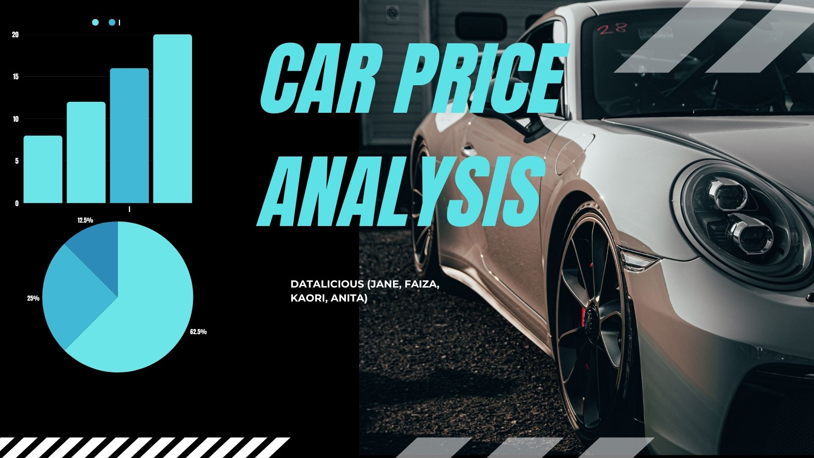

## Navigation
* [Data Investigations](https://github.com/Fazestar01/Car-Price-Analysis/blob/main/jupyter_notebooks/car_price_investigations.ipynb)
* [Raw Data](https://github.com/Fazestar01/Car-Price-Analysis/blob/main/data/CarPrice_Assignment.csv)
* [Cleaned Data](https://github.com/Fazestar01/Car-Price-Analysis/blob/main/data/cleanedcardata.csv)
* [Dashboard](https://public.tableau.com/app/profile/kaori.ikarashi/viz/CarPriceAnalysis_17501618237170/Story1?publish=yes)

## Dataset Content
* Data was acquried from a dataset on [Kaggle](https://www.kaggle.com/datasets/hellbuoy/car-price-prediction), the data includes car prices across wide array of variables such as height, weight, brand and more. 

## Business Requirements
* The problem statement on Kaggle defines the business requirements. 
* The problem statement states that we are assuming the role of a consultant for the automotive company Geely Auto.
* We have been tasked with examining how different factors effect pricing across the US market.

## Hypothesis and how to validate?
###  *Hypothesis 1* vehicle and engine size are the primary drivers of car pricing:
* This will be validated via linear regression models to display the R-Squared values and P-values of length, width, height and engine size. With this we can identify how strong the model is with the R-squared values and how confident we are with the P-values.
### *Hypothesis 2* Brand names have an impact on car pricing:
* This will be validated using a bar chart to see the differences in pricing and car brand. We will then use a boxplot chart to identify the distribution of pricing within those brands to gain greater insights.
### *Hypothesis 3* Drive wheel is a key differentiator in pricing strategy:
* We will validate this by using a boxplot chart that shows the distribution of pricing across rear wheel, four wheel and front wheel drive. 

## Hypothesis testing:
All visualisations that test our hypotheses can be found in this [Dashboard](https://public.tableau.com/app/profile/kaori.ikarashi/viz/CarPriceAnalysis_17501618237170/Story1?publish=yes). 

### *Hypothesis 1* vehicle and engine size are the primary drivers of car pricing
#### linear regression model:
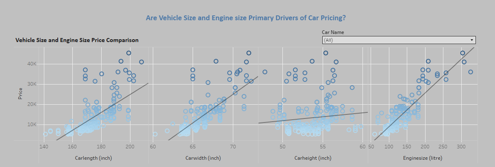

*The R-Squared and P-Values are displayed in the tooltip of the dashboard visualisations* 
#### Is car length a primary driver of car pricing?

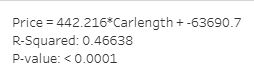

With an R-Squared value of 0.46 we can see see that the car length linear regression model is a moderate fit and with a P-value of 0.0001 we can be highly confident in that relationship.

#### Is car width a primary driver in car pricing?
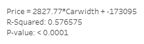

With an R-Squared value of 0.58 (rounded up to two decimal places) the model is an even better fit than car length and with P-Value of 0.0001 we can be highly confident in this finding.

#### Is car height a primary driver in car pricing?
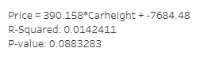

With a low R-Squared value of 0.01 and higher P-value of 0.089 we can see that there seems to be no meaningful relationship between car height and car pricing.

#### Is Engine size a primary driver in car pricing?
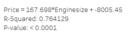

With high R-Squared value of 0.76 and a P-value of 0.0001 this factor is the best predictor for price, with an incredibly strong relationship. 

#### Verdict:
All factors except for car height are good predictors for car pricing, with engine size having the strongest correlation with price. We can accept the altenative hypothesis and reject the null hypothesis.

### *Hypothesis 2* Brand names have an impact on car pricing:

From the bar chart we can see that there is a relationship between branding and price, with brands such as Jaguar, Buick and Porsche having the highest median prices and brands such Honda and Chevrolet having the lowest.
The boxplot shows us that the distribution within brand varies for example BMW has a large distance between lower and upper whiskers, Chevrolet having very little variation and Toyota having a large amount outliers (since we are using the median rather than mean the effect of those outliers will be minimal).

#### Verdict:
There seems to be a clear patten of brand names effecting price, thus we can reject the null hypothesis and accept the alternative hypothesis. 

### *Hypothesis 3* Drive wheel is a key differentiator in pricing strategy:
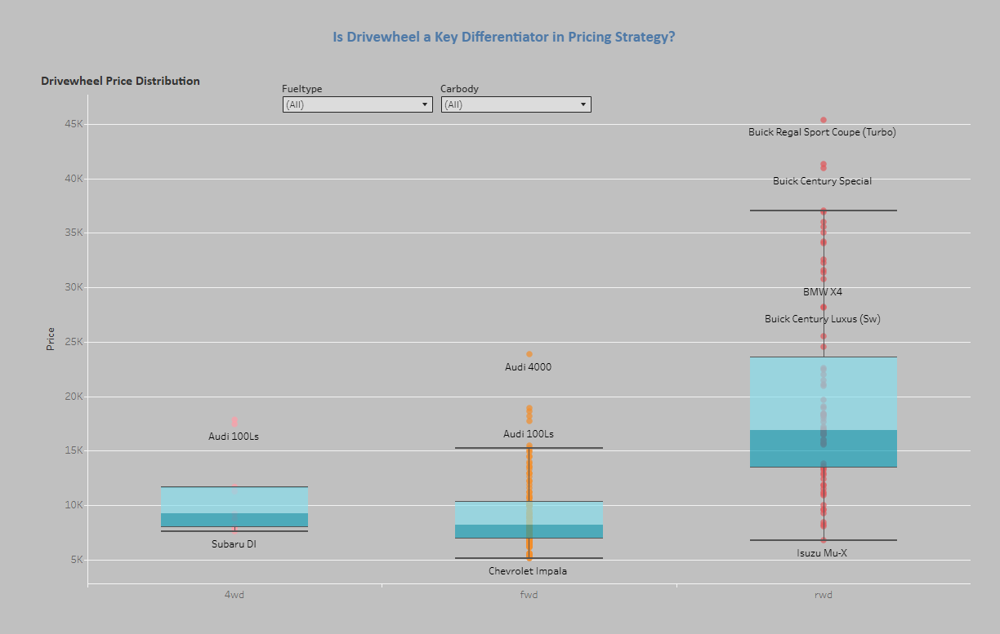
The boxplots show that rear wheel drive cars tend to be most expensive and 4 wheel drive and front wheel drive are fairly similar in price. Rear wheel drive has the most variation in distribution and both rear wheel and front wheel have outliers in the higher price point. 

#### Verdict:
Our hypothesis is correct that is a relationship between drive wheel and price, however this seems to only be true is so far as rear wheel drive cars tend to be more expensive. 

## Project Plan
### High-Level Steps Taken

**Angle Used**  
This project investigates the key factors that influence car pricing in the U.S. market, focusing on how different factors shape value. The goal was to generate actionable insights that could support pricing strategy, competitive positioning, or product development for an automotive company entering the market.

**Dataset Selection**  
We selected the [Car Price Prediction dataset on Kaggle](https://www.kaggle.com/datasets/hellbuoy/car-price-prediction) for its wide coverage of useful variables — including brand, engine size, weight and more making it ideal for both statistical testing and visual storytelling.

**Planning & Analysis Flow**
- Defined hypotheses (H1–H4) to guide exploratory work and support business-focused questions.
- Performed descriptive analysis to explore distributions, spot outliers, and assess feature importance.
- Conducted hypothesis testing using linear regression and data visualisations.
- Built interactive visual dashboards in Tableau to present findings in a clear and engaging format.

**Data Cleaning**
- Removed duplicates and handled missing/null values.
- Fix errors in the data.
- Encode to variables to numeric if necessary.

### Data Management Throughout the Project

| **Step**        | **Action**                                                                                                                                             |
|-----------------|---------------------------------------------------------------------------------------------------------------------------------------------------------|
| **Collection**  | Downloaded CSV file from Kaggle and stored it in a version-controlled GitHub repository for team collaboration.                                       |
| **Processing**  | Used Python (Pandas) in Jupyter Notebook to clean and transform data, including formatting, encoding, and feature engineering.                         |
| **Analysis**    | Performed EDA in both Jupyter and Tableau. Applied statistical tests suited to each variable type and distribution (e.g., t-tests, ANOVA, Wilcoxon).   |
| **Interpretation** | Combined numeric/statistical insights (e.g., p-values) with Tableau dashboards to communicate findings through dynamic charts and annotated stories. |

---

### Rationale for Research Methodologies

- **Hypothesis-Driven Approach:** We defined practical questions relevant to strategic decisions and tested them with appropriate statistical methods.
- **Tableau Public for Storytelling:** Enabled the team to create highly interactive and filterable dashboards for accessible, intuitive data exploration.
- **Python for Processing:** All cleaning and transformation were done in Python to ensure transparency, reproducibility, and modular processing.

## The rationale to map the business requirements to the Data Visualisations
#### Identify Key Drivers of Car Price Business Need: 
Understanding which features most influence pricing to support pricing strategy or customer targeting

Viusalisation: 
- Scatter plots of Engine Size and vehicle size vs Price
- Box plots of Drive Wheel vs Price Rationale: These visuals make it easy to see trends and variation across technical specs. Outliers or clusters can suggest relationships worth exploring with statistical testing.

### Compare Brand Positioning in the Market Business Need:
Evaluate how brands are priced in relation to each other to guide competitive analysis or partnership decisions.

Visualisation: 
- Bar charts showing Average Price by Brand
- Box plots showing Price spread within each brand Rationale: Highlights both the average market position and the consistency or variation in pricing within a brand—key for brand strategy.

### Assess Pricing Strategy Based on Drive wheel Configuration Business Need:
Determine how drive wheel (FWD, RWD, 4WD) impacts perceived value or cost to align with customer preferences

Visualisation:
 - Box plots or grouped bar charts of Drive Wheel vs Price Rationale: These plots show how drivetrain types cluster at different price tiers, helping identify if pricing strategies align with drivetrain desirability.

### Monitor Variability in Price Across Technical Specs Business Need:
Understand how variability in engine size, weight, and dimensions affects pricing to spot inconsistent or misaligned pricing.

Visualisation:
- Line graphs or histograms for price distribution Rationale: Helps detect relationships between variables and whether price changes smoothly or erratically with technical attributes.

## Analysis techniques used
* The ETL pipeline was done in a Jupyter notebook using pandas which can be found  [here](https://github.com/Fazestar01/Car-Price-Analysis/blob/main/jupyter_notebooks/car_price_investigations.ipynb). This allows a structured approach to data cleaning as you can see what you've done previously very clearly.
* The data was not paticularly limiting, except it did not include what form of measurements it used. This however did not stop us identifying trends in the data. 
* We used generative AI to resolve questions regarding dashboarding and git. 

## Ethical considerations
* The dataset contains no sensitive information thus does not require anonymisation or other ethical steps.

## Dashboard Design
*The Dashboard can be found [here](https://public.tableau.com/app/profile/kaori.ikarashi/viz/CarPriceAnalysis_17501618237170/Story1?publish=yes)*.
### Dashboard preparation:
The car name consists of the brand and manufacturer, so it is grouped into manufacturer to make the visualisation less crowded.

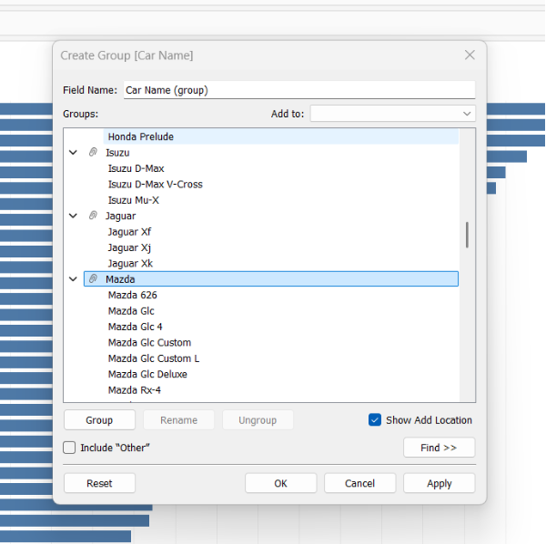

We used a Tableau Story format to keep the dashboard uncluttered. Viewers can explore each hypothesis using the buttons at the top.

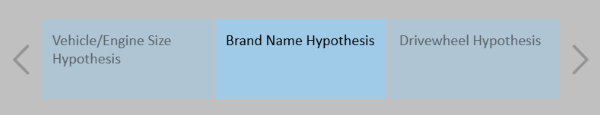

### Dashboard for hypothesis 1:
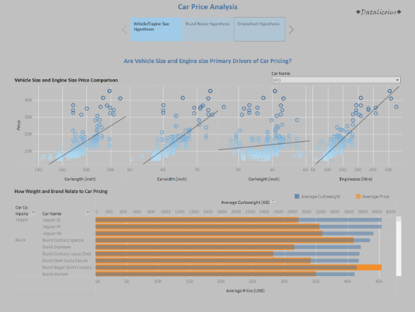

We used scatter plots to explore the relationship between vehicle size and price, adding trend lines to highlight which size factor has the most significant impact on pricing.

The second graph uses a dual-axis chart to compare curb weight and price by car brand, helping to reveal each brand’s weight–price profile.

We added a Car Name filter, allowing viewers to focus on vehicles from a specific manufacturer quickly.

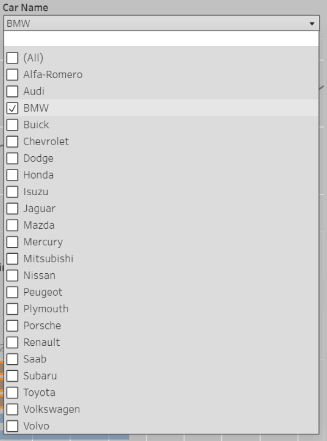

### Dashboard for hypothesis 2:
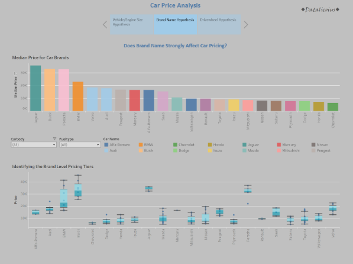

We are exploring whether brand name affects car pricing.
The first visualisation highlights which manufacturers tend to price their vehicles higher on average.
The second graph illustrates the distribution of prices within each brand, enabling us to understand how consistent a company is with its pricing and identify brands with greater price variation.

To enhance interactivity, we added Carbody and Fueltype filters, allowing viewers to explore pricing patterns across different vehicle types and fuel categories.

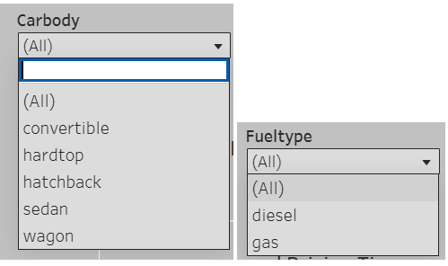

### Dashboard for hypothesis 3:

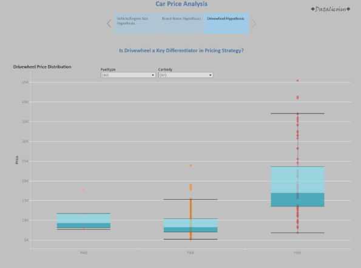

We are analysing whether drivewheel type affects car pricing.

A box plot is used to compare the price distribution across 4WD, FWD, and RWD vehicles.
To enhance interactivity, we included the same Carbody and Fueltype filters as in Hypothesis 2, allowing viewers to explore pricing patterns in more detail.

### Our logo:

To highlight that our team created this work, Datalicious, we added our logo to the top of each page

## Development Roadmap and issues faced
* The types of measurements for things such as height, weight etc were not included, to resolve this we asked Copilot what it thought the most reasonable assumption of the measurements are.
* One aspect of data cleaning was overlooked, 'VW' should have been changed to 'Volkswagen' in the Jupyter notebook. This was solved by using the 'groupby' function in Tableau to group VW under Volkswagen. 
* We had struggles with git that were resolved with a mixture of co-pilot and help from our tutors.
* Images couldn't be moved into an image folder without them being removed from github. That will be something we look more into for the next project.

## Main Data Analysis Libraries
* Pandas
* Numpy

## Credits 

* Code Institute Learning Management System modules on pandas and tableau
* Microsoft co-pilot aid in code generation
* Chat-GPT for questions regarding dashboarding in Tableau
* [Markdown Guide](https://www.markdownguide.org/)

### Media

- Header image was made using Canva

## Acknowledgements
* A huge thank you to Mark, Emma, John, Spencer and Niel from Code institute for their hard work in tutoring us! And a thank you to Carlos who showed us how to add a back to the top button on markdown. 

[Back to top](#top)