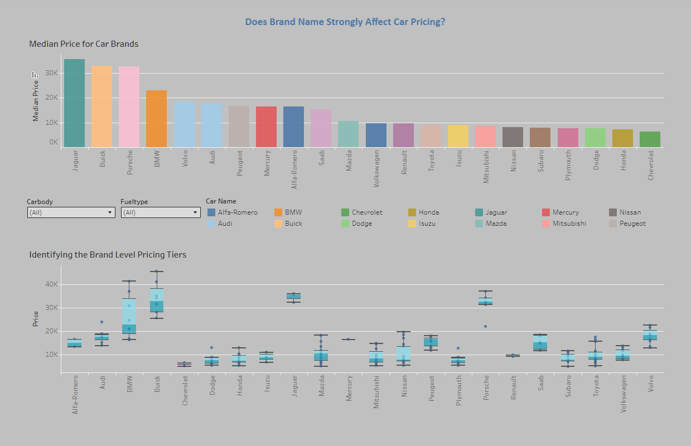

# Car Price Analysis
## Team Datalicious: (Jane, Faiza, Kaori and Anita)

**Car Price Analysis Project** is a group hackathon project focussed on the ETL (Extract, Transform, Load) pipeline in Jupyter Notebook and visualisations in Tableau. The Project examines car pricing across range of factor to assess the primary drivers behind car prices. 
# 

## Navigation
* [Data Investigations](https://github.com/Fazestar01/Car-Price-Analysis/blob/main/jupyter_notebooks/car_price_investigations.ipynb)
* [Raw Data](https://github.com/Fazestar01/Car-Price-Analysis/blob/main/data/CarPrice_Assignment.csv)
* [Cleaned Data](https://github.com/Fazestar01/Car-Price-Analysis/blob/main/data/cleanedcardata.csv)
* [Dashboard](https://public.tableau.com/app/profile/kaori.ikarashi/viz/CarPriceAnalysis_17501618237170/Story1?publish=yes)

## Dataset Content
* Data was acquried from a dataset on [Kaggle](https://www.kaggle.com/datasets/hellbuoy/car-price-prediction), the data includes car prices across wide array of variables such as height, weight, brand and more. 

## Business Requirements
* The problem statement on Kaggle defines the business requirements. 
* The problem statement states that we are assuming the role of a consultant for the automotive company Geely Auto.
* We have been tasked with examining how different factors effect pricing across the US market.

## Hypothesis and how to validate?
###  *Hypothesis 1* vehicle and engine size are the primary drivers of car pricing:
* This will be validated via linear regression models to display the R-Squared values and P-values of length, width, height and engine size. With this can identify how strong the model is with the R-squared values and how confident we are with the P-values.
### *Hypothesis 2* Brand names have an impact on car pricing:
* This will be validated using a bar chart to see the differences in pricing and car brand. We will then use a boxplot chart to identify the distribution of pricing within those brands to gain greater insights.
### *Hypothesis 3* Drive wheel is a key differentiator in pricing strategy:
* We will validate this by using a boxplot chart that shows the distribution of pricing across rear wheel, four wheel and front wheel drive. 

## Hypothesis testing:
All visualisations that test our hypotheses can be found in this [Dashboard](https://public.tableau.com/app/profile/kaori.ikarashi/viz/CarPriceAnalysis_17501618237170/Story1?publish=yes). 

### *Hypothesis 1* vehicle and engine size are the primary drivers of car pricing
#### linear regression model:

*The R-Squared and P-Values are displayed in the tooltip of the dashboard visualisations* 
#### Is car length a primary driver of car pricing?

With an R-Squared value of 0.46 we can see see that the car length linear regression model is a moderate fit and with a P-value of 0.0001 we can be highly confident in that relationship.

#### Is car width a primary driver in car pricing?

With an R-Squared value of 0.58 (rounded up to two decimal places) the model is an even better fit than car length and with P-Value of 0.0001 we can be highly confident in this finding.

#### Is car height a primary driver in car pricing?

With a low R-Squared value of 0.01 and higher P-value of 0.089 we can see that there seems to be no meaningful relationship between car height and car pricing.

#### Is Engine size a primary driver in car pricing?

With high R-Squared value of 0.76 and a P-value of 0.0001 this factor is the best predictor for price, with an incredibly strong relationship. 

#### Verdict:
All factors except for car height are good predictors for car pricing, with engine size having the strongest correlation with price. We can accept the altenative hypothesis and reject the null hypothesis.

### *Hypothesis 2* Brand names have an impact on car pricing:

From the bar chart we can see that there is a relationship between branding and price, with brands such as Jaguar, Buick and Porsche having the highest median prices and brands such Honda and Chevrolet having the lowest.
The boxplot shows us that the distribution within brand varies for example BMW has a large distance between lower and upper whiskers, Chevrolet having very little variation and Toyota having a large amount outliers (since we are using the median rather than mean the effect of those outliers will be minimal).

#### Verdict:
There seems to be a clear patten of brand names effecting price, thus we can reject the null hypothesis and accept the alternative hypothesis. 

### *Hypothesis 3*: Drive wheel is a key differentiator in pricing strategy

The boxplots show that rear wheel drive cars tend to be most expensive and 4 wheel drive and front wheel drive are fairly similar in price. Rear wheel drive has the most variation in distribution and both rear wheel and front wheel have outliers in the higher price point. 

### Verdict:
Our hypothesis is correct that is a relationship between drive wheel and price, however this seems to only be true is so far as rear wheel drive cars tend to be more expensive. 

## Project Plan
* Outline the high-level steps taken for the analysis.
* How was the data managed throughout the collection, processing, analysis and interpretation steps?
* Why did you choose the research methodologies you used?

## The rationale to map the business requirements to the Data Visualisations
* List your business requirements and a rationale to map them to the Data Visualisations

## Analysis techniques used
* List the data analysis methods used and explain limitations or alternative approaches.
* How did you structure the data analysis techniques. Justify your response.
* Did the data limit you, and did you use an alternative approach to meet these challenges?
* How did you use generative AI tools to help with ideation, design thinking and code optimisation?

## Ethical considerations
* The dataset contains no sensitive information and thus does not require anonymisation or other ethical steps.

## Dashboard Design
* List all dashboard pages and their content, either blocks of information or widgets, like buttons, checkboxes, images, or any other item that your dashboard library supports.
* Later, during the project development, you may revisit your dashboard plan to update a given feature (for example, at the beginning of the project you were confident you would use a given plot to display an insight but subsequently you used another plot type).
* How were data insights communicated to technical and non-technical audiences?
* Explain how the dashboard was designed to communicate complex data insights to different audiences. 

## Development Roadmap and issues faced
* The types of measurements for things such as height, weight etc were not included, to resolve this we asked Copilot what it thought the most reasonable assumption of the measurements are.
* One aspect of data cleaning was overlooked, 'VW' should have been changed to 'Volkswagen' in the Jupyter notebook. This was solved by using the 'groupby' function in Tableau to group VW under Volkswagen. 
* We had struggles with git that were resolved with a mixture of co-pilot and help from our tutors.

## Main Data Analysis Libraries
* Pandas
* Numpy

## Credits 

* Code Institute Learning Management System modules on pandas and tableau
* Microsoft co-pilot aid in code generation
* Chat-GPT for questions regarding dashboarding in Tableau
* [Markdown Guide](https://www.markdownguide.org/)

### Media

- Header image was made using Canva

## Acknowledgements
* A huge thank you to Mark, Emma, John, Spencer and Niel from Code institute for their hard work in tutoring us! And a thank you to Carlos who showed us how to add a back to the top button on markdown. 

[Back to top](#top)