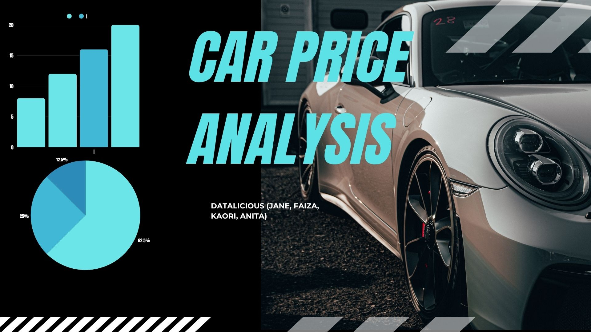

# Car Price Analysis Project   Date: 18 June 2025
## Team: Datalicious
##### Team Members: Anita, Faiza, Kaori, Jane
###### 18 June 2025
## Car Price Analysis Project is a group hackathon project focussed on the ETL (Extract, Transform, Load) pipeline in Jupyter Notebook and visualisations in Tableau. The Project examines car pricing across range of factor to assess the primary drivers behind car prices.

## The dataset contains specifications of various car models, including brand, dimensions (length, width, height), engine size, curb weight, drive wheel type, fuel type, and price. The data was sourced from a public Kaggle dataset, allowing manageable analysis for business insights.

# 

## Navigation
* [Data Investigations](https://github.com/Fazestar01/Car-Price-Analysis/blob/main/jupyter_notebooks/car_price_investigations.ipynb)
* [Raw Data](https://github.com/Fazestar01/Car-Price-Analysis/blob/main/data/CarPrice_Assignment.csv)
* [Cleaned Data](https://github.com/Fazestar01/Car-Price-Analysis/blob/main/data/cleanedcardata.csv)
* [Dashboard](https://public.tableau.com/app/profile/kaori.ikarashi/viz/CarPriceAnalysis_17501618237170/Story1?publish=yes)

## Dataset Content
* Data was acquried from a dataset on [Kaggle](https://www.kaggle.com/datasets/hellbuoy/car-price-prediction), the data includes car prices across wide array of variables such as height, weight, brand and more. 

# Business Requirements
