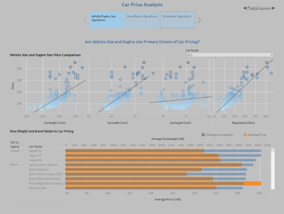
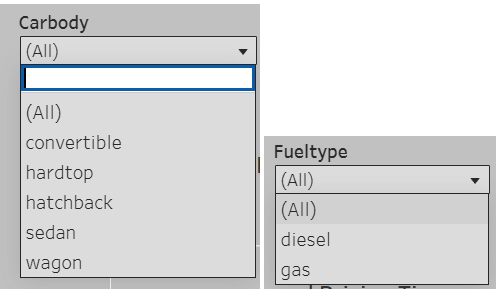
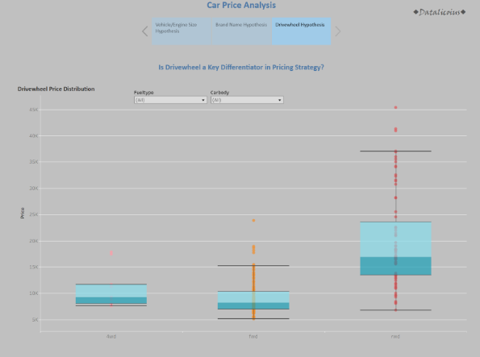

# Car Price Analysis Project   Date: 18 June 2025
## Team: Datalicious
##### Team Members: Anita, Faiza, Kaori, Jane
###### 18 June 2025
## Car Price Analysis Project is a group hackathon project focussed on the ETL (Extract, Transform, Load) pipeline in Jupyter Notebook and visualisations in Tableau. The Project examines car pricing across range of factor to assess the primary drivers behind car prices.

## The dataset contains specifications of various car models, including brand, dimensions (length, width, height), engine size, curb weight, drive wheel type, fuel type, and price. The data was sourced from a public Kaggle dataset, allowing manageable analysis for business insights.

# 

## Navigation
* [Data Investigations](https://github.com/Fazestar01/Car-Price-Analysis/blob/main/jupyter_notebooks/car_price_investigations.ipynb)
* [Raw Data](https://github.com/Fazestar01/Car-Price-Analysis/blob/main/data/CarPrice_Assignment.csv)
* [Cleaned Data](https://github.com/Fazestar01/Car-Price-Analysis/blob/main/data/cleanedcardata.csv)
* [Dashboard](https://public.tableau.com/app/profile/kaori.ikarashi/viz/CarPriceAnalysis_17501618237170/Story1?publish=yes)

## Dataset Content
* Data was acquried from a dataset on [Kaggle](https://www.kaggle.com/datasets/hellbuoy/car-price-prediction), the data includes car prices across wide array of variables such as height, weight, brand and more. 

# Business Requirements
* The problem statement on Kaggle defines the business requirements. 
* The problem statement states that we are assuming the role of a consultant for the automotive company Geely Auto.
* We have been tasked with examining how different factors effect pricing across the US market.

## Hypothesis and how to validate?
###  *Hypothesis 1* vehicle and engine size are the primary drivers of car pricing:
* This will be validated via linear regression models to display the R-Squared values and P-values of length, width, height and engine size. With this we can identify how strong the model is with the R-squared values and how confident we are with the P-values.
### *Hypothesis 2* Brand names have an impact on car pricing:
* This will be validated using a bar chart to see the differences in pricing and car brand. We will then use a boxplot chart to identify the distribution of pricing within those brands to gain greater insights.
### *Hypothesis 3* Drive wheel is a key differentiator in pricing strategy:
* We will validate this by using a boxplot chart that shows the distribution of pricing across rear wheel, four wheel and front wheel drive. 

## Hypothesis testing:
All visualisations that test our hypotheses can be found in this [Dashboard](https://public.tableau.com/app/profile/kaori.ikarashi/viz/CarPriceAnalysis_17501618237170/Story1?publish=yes). 

## Project Plan
The project board that aided in our planning and organisation can be found here

### High-Level Steps Taken
Angle Used
This project investigates the key factors that influence car pricing in the U.S. market, focusing on how different factors shape value. The goal was to generate actionable insights that could support pricing strategy, competitive positioning, or product development for an automotive company entering the market.

### Dataset Selection ###

- Removed duplicates and handled missing/null values.
- Fix errors in the data.
- Encode to variables to numeric if necessary.

We selected the [Car Price Prediction dataset on Kaggle](https://www.kaggle.com/datasets/hellbuoy/car-price-prediction) for its wide coverage of useful variables — including brand, engine size, weight and more making it ideal for both statistical testing and visual storytelling.

## Analysis techniques used
* The ETL pipeline was done in a Jupyter notebook using pandas which can be found  [here](https://github.com/Fazestar01/Car-Price-Analysis/blob/main/jupyter_notebooks/car_price_investigations.ipynb). This allows a structured approach to data cleaning as you can see what you've done previously very clearly.
* The data was not paticularly limiting, except it did not include what form of measurements it used. This however did not stop us identifying trends in the data. 
* We used generative AI to resolve questions regarding dashboarding and git. 

## Ethical considerations
* The dataset contains no sensitive information thus does not require anonymisation or other ethical steps.

## Dashboard Design
*The Dashboard can be found [here](https://public.tableau.com/app/profile/kaori.ikarashi/viz/CarPriceAnalysis_17501618237170/Story1?publish=yes)*.
### Dashboard preparation:
The car name consists of the brand and manufacturer, so it is grouped into manufacturer to make the visualisation less crowded.

We used a Tableau Story format to keep the dashboard uncluttered. Viewers can explore each hypothesis using the buttons at the top.

### Dashboard for hypothesis 1:

We used scatter plots to explore the relationship between vehicle size and price, adding trend lines to highlight which size factor has the most significant impact on pricing.

The second graph uses a dual-axis chart to compare curb weight and price by car brand, helping to reveal each brand’s weight–price profile.

We added a Car Name filter, allowing viewers to focus on vehicles from a specific manufacturer quickly.

### Dashboard for hypothesis 2:

We are exploring whether brand name affects car pricing.
The first visualisation highlights which manufacturers tend to price their vehicles higher on average.
The second graph illustrates the distribution of prices within each brand, enabling us to understand how consistent a company is with its pricing and identify brands with greater price variation.

To enhance interactivity, we added Carbody and Fueltype filters, allowing viewers to explore pricing patterns across different vehicle types and fuel categories.

### Dashboard for hypothesis 3:

We are analysing whether drivewheel type affects car pricing.

A box plot is used to compare the price distribution across 4WD, FWD, and RWD vehicles.
To enhance interactivity, we included the same Carbody and Fueltype filters as in Hypothesis 2, allowing viewers to explore pricing patterns in more detail.

### Our logo:

To highlight that our team created this work, Datalicious, we added our logo to the top of each page

## Development Roadmap and issues faced
* The types of measurements for things such as height, weight etc were not included, to resolve this we asked Copilot what it thought the most reasonable assumption of the measurements are.
* One aspect of data cleaning was overlooked, 'VW' should have been changed to 'Volkswagen' in the Jupyter notebook. This was solved by using the 'groupby' function in Tableau to group VW under Volkswagen. 
* We had struggles with git that were resolved with a mixture of co-pilot and help from our tutors.
* Images couldn't be moved into an image folder without them being removed from github. That will be something we look more into for the next project.

## Main Data Analysis Libraries
* Pandas
* Numpy

## Credits 

* Code Institute Learning Management System modules on pandas and tableau
* Microsoft co-pilot aid in code generation
* Chat-GPT for questions regarding dashboarding in Tableau
* [Markdown Guide](https://www.markdownguide.org/)

### Media

- Header image was made using Canva

## Acknowledgements
* A huge thank you to Mark, Emma, John, Spencer and Niel from Code institute for their hard work in tutoring us! And a thank you to Carlos who showed us how to add a back to the top button on markdown. 

[Back to top](#top)